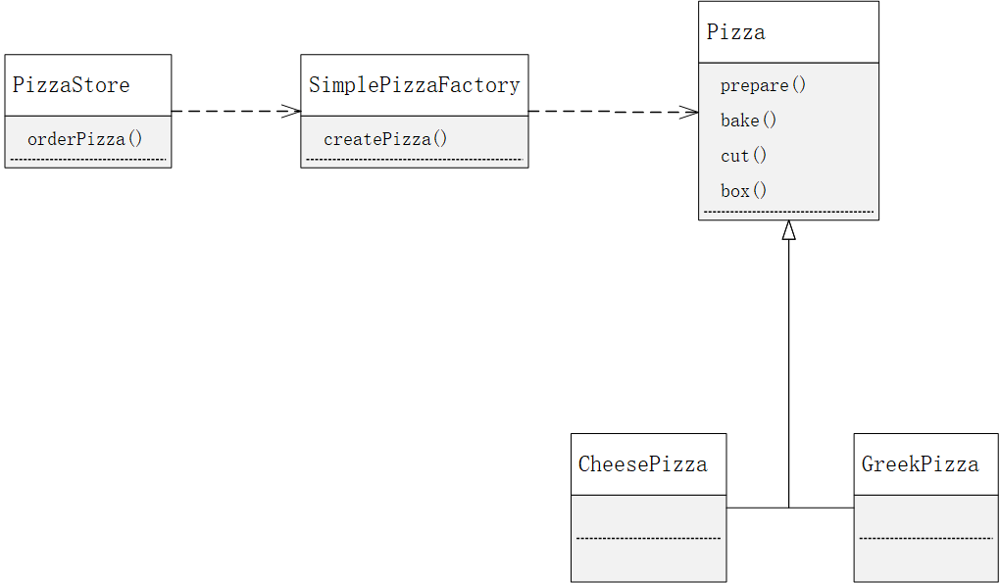
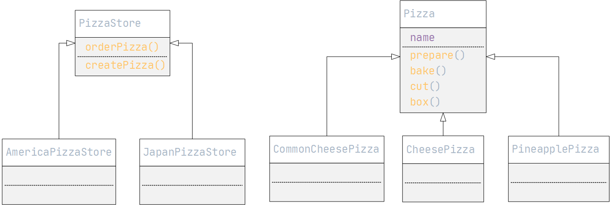
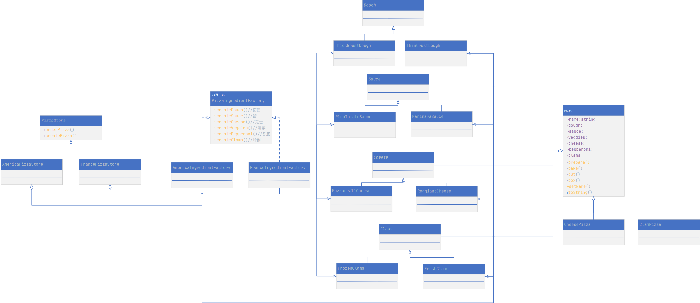

# 工厂模式

## 工厂模式分类

1. 简单工厂模式
2. 工厂方法模式
3. 抽象工厂模式

## 工厂模式

### 简单工厂模式

#### 需求简要说明

> Pizza 店可以随时加入流行风味的 Pizza，也可以随时取消对应的 Pizza，只需要修改工厂代码即可

#### UML 图



### 工厂方法模式

> 所有工厂模式都用来封装对象的创建。
>
> 工厂方法模式通过让子类决定该创建的对象是什么，来表达创建过程封装的目的。
>
> 工厂方法模式定义了一个创建对象的接口，但由子类决定要实例化的类是哪一个。工厂方法让类把实例化推迟到子类。

#### 需求简要说明

>有很多地区加盟 Pizza 店，每家 Pizza 店都可能提供不同的风味的 Pizza。希望建立一个框架，把加盟店和创建 Pizza 捆绑在一起时同时又能保持一定的弹性。

#### UML 图



### 简单工厂和工厂方法区别

```
简单工厂把全部的事情，在一个地方都处理完成。然后工厂方法却是创建一个框架，让子类决定要如何实现。
简单工厂可以将对象创建封装起来，但不具备工厂方法的弹性，不能随意变更正在创建的产品。
```

### 抽象工厂模式

> 抽象工厂模式提供一个接口，用于创建相关或者依赖对象的家族，而不需要明确指定具体类。
>
> 抽象工厂的任务是定义一个负责创建一组产品的接口，这个接口内的每一个方法都负责创建一个具体产品，同时我们利用实现抽象工厂的子类来提供这些具体的做法；

需求简要说明

> 各个加盟店的 Pizza 的原料不同

#### UML 图




